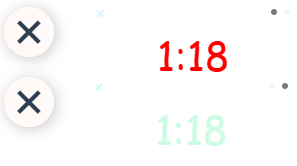

# Tool Bar

*component documentation*

## API
### Props

- `components`
  - **Description:** the total amount of components to be rendered
  - **Type:** component[]
  - **Default:** 0
- `size`

  - **Description:** the size of the icon
  - **Type:** number
  - **Default:** 0

`conponent`:

```
icon: string,
icon_color: string,
use_switch: boolean,
slot_width: string,
component_state_1: Component,
component_state_2: Component,
component_props_1: {options},
component_props_2: {options}
```

### Slots

- `slot-index-1`
  - **Description:** the origin state of the component
- `slot-index-2` (if need switch bar)
  - **Description:** another state of the component


## Usage

### Common usage

the preferred usage is:

- first create a component list as below:

```
const elements = [
  {
    icon: 'bx bx-x',
    icon_color: '#CDFBE4',
    use_switch: true,
    slot_width: 200,
    component_state_1: Time,
    component_state_2: Time,
    component_props_1: {color: '#CDFBE4'},
    component_props_2: {color: 'red'}
  },
  {
    icon: 'bx bx-x',
    icon_color: '#CDFBE4',
    use_switch: true,
    slot_width: 200,
    component_state_1: Time,
    component_state_2: Time,
    component_props_1: {color: '#CDFBE4'},
    component_props_2: {color: 'red'}
  }
]
```

- then use the component to render a tool bar

`<tool-bar :components="elements" :size="size"></tool-bar>`


### Example usage

`<tool-bar :components="elements" :size="size"></tool-bar>`

then we got




